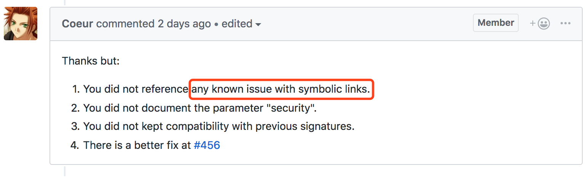

# ZipArchive 2.1.4 dir traversal 0-Day

## How to test
* run: `./poc.sh`

## Root cause
* symlink in zip

## Additional info
This issue has been reported, but ignored by the developers.
* https://github.com/ZipArchive/ZipArchive/pull/454
* https://zipperdown.org/

